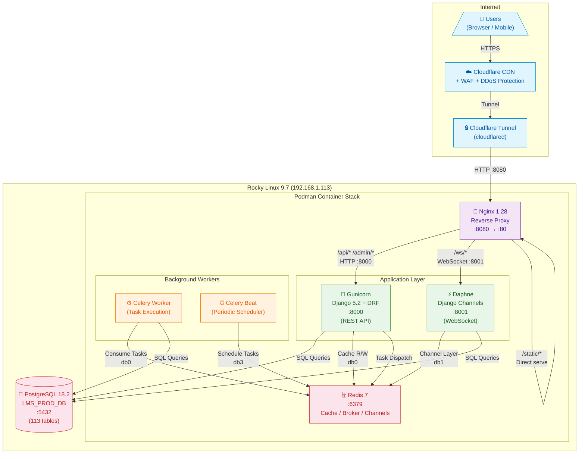
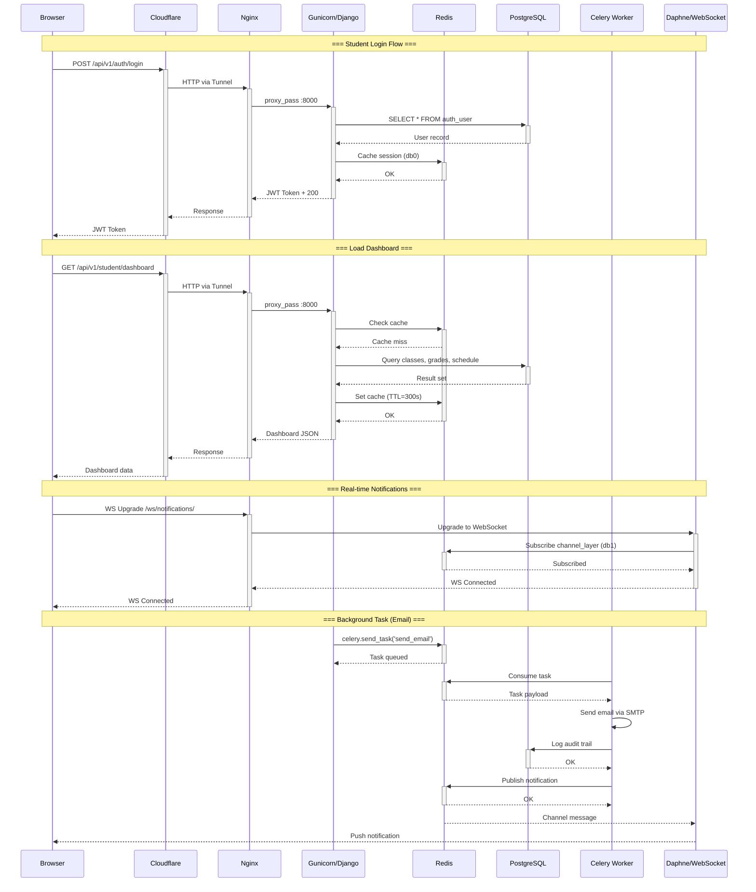
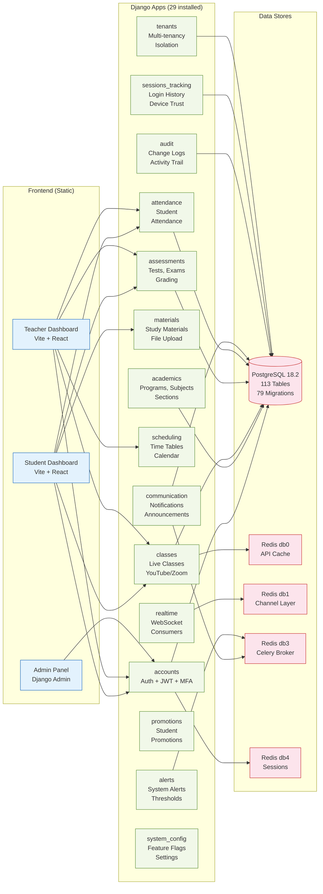
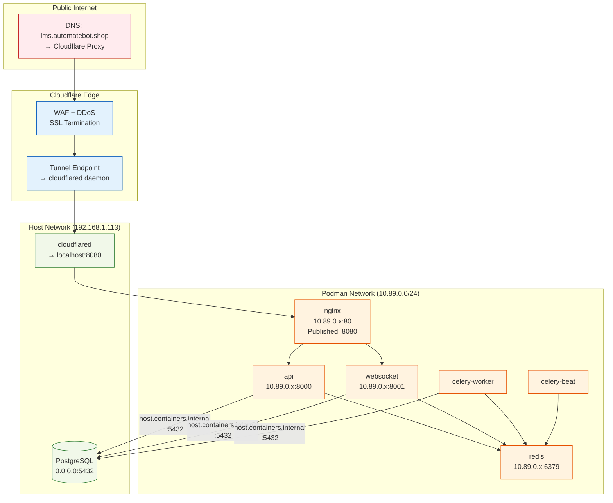
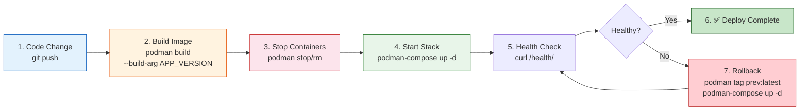

# LMS Enterprise — Architecture & Dataflow Diagrams

---

## 1. High-Level Architecture & Dataflow

Shows all components, their ports, and how data flows between them.

### Component Details

| Container            | Image                    | Port | Purpose                                |
|----------------------|--------------------------|------|----------------------------------------|
| `enable-lms-nginx`   | `enable-lms-nginx:latest`| 8080 | Reverse proxy, static files, rate limiting |
| `enable-lms-api`     | `enable-lms:latest`      | 8000 | REST API (Gunicorn, 4 workers)         |
| `enable-lms-websocket`| `enable-lms:latest`     | 8001 | WebSocket server (Daphne, ASGI)        |
| `enable-lms-celery-worker`| `enable-lms:latest` | —    | Async task execution                   |
| `enable-lms-celery-beat`| `enable-lms:latest`    | —    | Periodic task scheduler                |
| `enable-lms-redis`   | `redis:7-alpine`         | 6379 | Cache (db0), Channels (db1), Celery (db3), Sessions (db4) |
| PostgreSQL           | Host-installed           | 5432 | Primary data store (113 tables)        |

---

## 2. Request Flow — Sequence Diagram

Shows the complete lifecycle of student login, dashboard load, WebSocket connection, and background task processing.

---

## 3. Application Module & Data Store Map

Shows how Django apps connect to frontends and data stores.

### Redis Database Allocation

| DB  | Purpose           | Used By                     | TTL     |
|-----|-------------------|-----------------------------|---------|
| db0 | API Cache + Celery Broker | API, Celery Worker/Beat | 300s    |
| db1 | Channel Layer     | Daphne (WebSocket)          | Session |
| db3 | Celery Beat Schedule | Celery Beat               | —       |
| db4 | Django Sessions   | API (DRF)                   | 1 week  |

---

## 4. Network Topology

---

## 5. Deployment Pipeline

